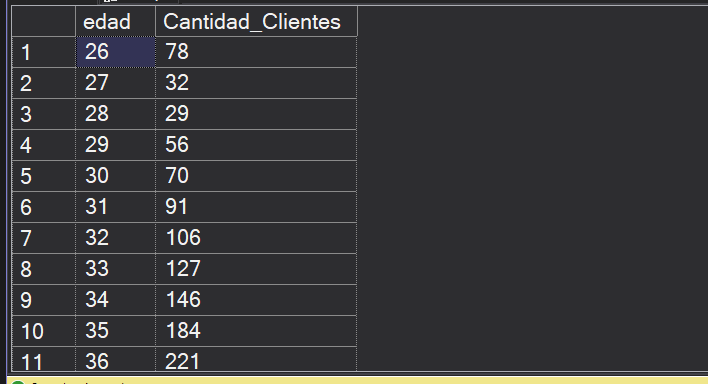
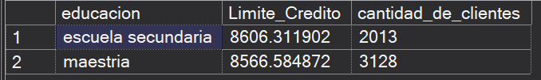
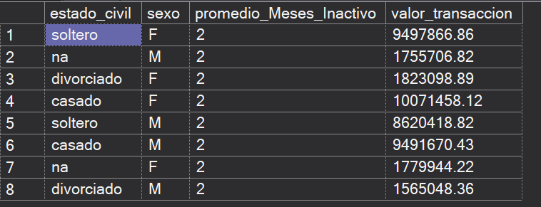
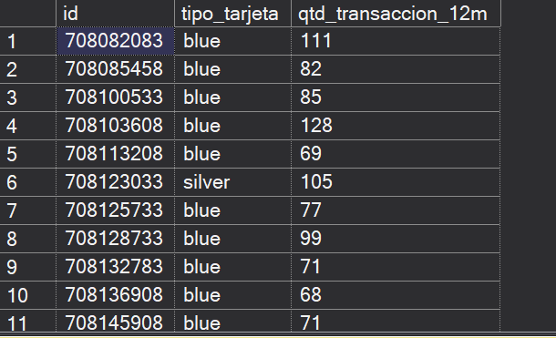
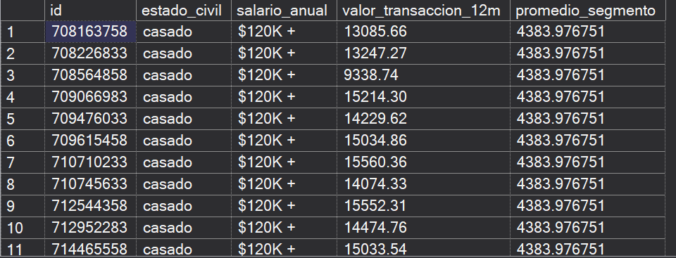
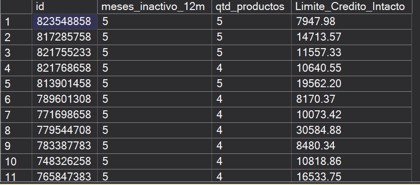
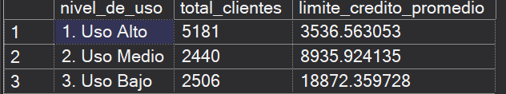
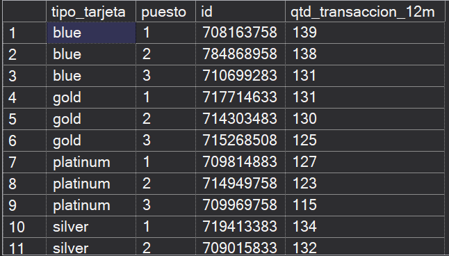
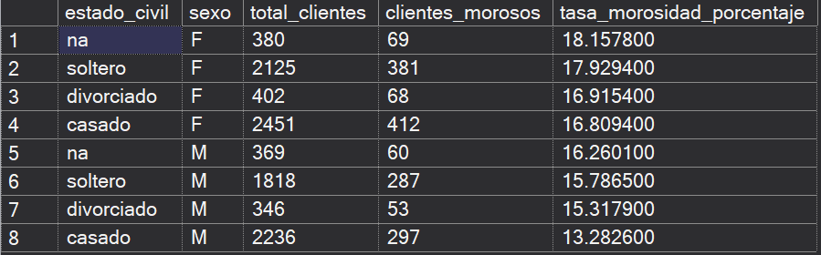
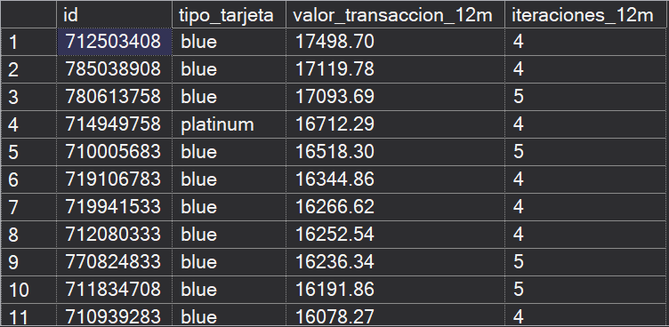

# Analisis_Data_Credito

## Resumen
*(Escribe aquí una breve descripción general de tu proyecto, qué herramientas utilizaste y qué problema estás resolviendo con el análisis de datos).*

## Objetivo de Proyecto 
*(Define cuál es la meta principal que buscas alcanzar con este análisis financiero o de créditos).*

## Preguntas

**1. ¿Cuántos son los clientes que tienen más edad?**

Agrupé a los clientes por su edad utilizando las funciones COUNT y GROUP BY, y ordené los resultados de forma ascendente para analizar la estructura demográfica y el rango etario de la cartera.
```sql
Select
         edad,
         COUNT(*) as Cantidad_Clientes
From [Proyecto_Personal].[dbo].[clientes_credito]
Group by edad
Order By edad 
```


#### Distribución por edad de los clientes de crédito

La edad con mayor concentración de clientes corresponde a los 44 años con un total de 500 personas, manteniéndose el grueso de la cartera en la etapa de madurez laboral (entre 40 y 53 años). La edad mínima registrada es de 26 años (78 clientes) y la máxima es de 73 años (1 cliente), observándose una caída drástica en la cantidad de clientes a partir de los 66 años. Adicionalmente, se aprecia un repunte notable a los 65 años con 101 clientes.

El banco podría diseñar campañas de colocación de créditos de mayor monto (como hipotecarios o vehiculares) orientadas al segmento de 40 a 50 años por su estabilidad económica, mientras que para el segmento joven (menores de 35 años) convendría ofrecer productos de entrada y bancarización con líneas de crédito moderadas para asegurar el recambio de la cartera.

**2. ¿Cuáles niveles educativos tienen un limite_credito promedio superior a $8,500, considerando solo aquellos grupos que tengan más de 2000 clientes en la base de datos?**

Calculé el límite de crédito promedio y el volumen total de clientes por nivel educativo utilizando las funciones AVG, COUNT y GROUP BY. Además, apliqué una cláusula HAVING para filtrar únicamente aquellos segmentos representativos con más de 2,000 clientes y un límite crediticio promedio superior a 8,500.
```sql
Select 
         educacion,
         AVG(limite_credito) as Limite_Credito,
         COUNT(id) as cantidad_de_clientes 
from [Proyecto_Personal].[dbo].[clientes_credito]
Group by educacion
Having 
         AVG(limite_credito) > 8500
         AND COUNT(id)>2000
```

#### Límite de crédito promedio y volumen de clientes por nivel educativo
Únicamente dos categorías cumplieron con los criterios de corte: escuela secundaria y maestría. El segmento de escuela secundaria registró un límite promedio ligeramente mayor con 8,606.31 y un total de 2,013 clientes, mientras que el segmento de maestría alcanzó un promedio de 8,566.58 pero con un volumen significativamente más alto de 3,128 clientes.

El banco puede enfocar estrategias diferenciadas para ambos grupos: para el segmento de maestría, dado su alto volumen y potencial de ingresos profesionales, conviene ofrecer ventas cruzadas de productos de inversión o líneas premium; para el grupo de secundaria, dado el límite asignado similar, el área de riesgos debería monitorear el comportamiento de pago y el ratio de endeudamiento para validar si la exposición crediticia se encuentra debidamente respaldada.

**3. ¿Qué grupos según su estado civil y sexo tienen un promedio de meses inactivo mayor a 1, pero a la vez generan un volumen total de transacciones superior a $100,000?**

Segmenté a los clientes por las dimensiones estado_civil y sexo utilizando las funciones AVG, SUM y GROUP BY. Para aislar los grupos de mayor valor transaccional que a la vez presentan ventanas de inactividad, apliqué un filtro con HAVING requiriendo un promedio de meses inactivo superior a 1 y un volumen total facturado superior a 1,000,000 en los últimos 12 meses.
```sql
Select 
         estado_civil,
         sexo,
         AVG(meses_inactivo_12m) as promedio_Meses_Inactivo,
         SUM(valor_transaccion_12m) as valor_transaccion
From [Proyecto_Personal].[dbo].[clientes_credito]
Group by 
         estado_civil,
         sexo
Having 
         AVG(meses_inactivo_12m)>1
         AND SUM(valor_transaccion_12m)>1000000
```


#### Comportamiento transaccional e inactividad por estado civil y sexo
Todos los subgrupos evaluados cumplieron con el umbral, promediando de forma generalizada 2 meses de inactividad en el último año. No obstante, el volumen transaccional evidencia una fuerte concentración: las mujeres casadas lideran la facturación con 10,071,458.12, seguidas por los hombres casados (9,491,670.43) y las mujeres solteras (9,497,866.86). En contraste, los segmentos de clientes divorciados y aquellos sin registrar ("na") registran los volúmenes más bajos, oscilando entre 1.5 y 1.8 millones.

Dado que incluso los segmentos de mayor facturación (casados y solteros) presentan pausas de consumo promedio de 2 meses, el banco debería implementar campañas automáticas de reactivación (trigger marketing) al cumplirse 30 a 45 días sin movimientos, ofreciendo beneficios o promociones en comercios clave para evitar la fuga de saldo hacia otras entidades y mantener la tarjeta como medio principal de pago.

**4. ¿Cuáles son los id y el tipo_tarjeta de los clientes que realizaron una cantidad de transacciones (qtd_transaccion_12m) superior al promedio de transacciones de los clientes que tienen tarjeta 'Blue'?**

Utilicé una subconsulta escalar en la cláusula WHERE para calcular primero el promedio de transacciones (AVG) del segmento con tarjeta 'Blue', utilizándolo como umbral dinámico para filtrar a todos los clientes cuyo volumen de operaciones anuales (qtd_transaccion_12m) superó dicha métrica.

```sql
Select
         id,
         tipo_tarjeta,
         qtd_transaccion_12m
From [Proyecto_Personal].[dbo].[clientes_credito]
Where
         qtd_transaccion_12m>(Select AVG(qtd_transaccion_12m) From [Proyecto_Personal].[dbo].[clientes_credito] Where tipo_tarjeta='blue')

```

#### Clientes con actividad transaccional superior al estándar de tarjeta 'Blue'

La consulta aísla a los tarjetahabientes de mayor recurrencia y uso operativo del portafolio. Dentro de este grupo destacan clientes que mantienen una tarjeta básica ('Blue') a pesar de registrar un comportamiento transaccional significativamente superior al promedio de su categoría, equiparándose al ritmo de clientes de gamas superiores (Silver, Gold o Platinum).

El banco puede utilizar este segmento identificado como público objetivo para campañas de actualización de producto (upgrade). Migrar a los clientes con tarjeta 'Blue' de alta transaccionalidad hacia categorías superiores incrementaría la rentabilidad del banco por comisiones e incentivos de facturación, a la vez que se mejora la retención y fidelización del cliente mediante mejores programas de beneficios o recompensas.

**5. ¿Cuáles son los id de los clientes cuyo valor de transacción anual supera en al menos el doble (200%) el promedio de gasto de su mismo segmento demográfico (definido por estado civil y salario anual)?**

Para resolver esta consulta analítica avanzada, utilicé una Expresión de Tabla Común (CTE) combinada con una función de ventana (AVG() OVER (PARTITION BY...)). Esto permite calcular el promedio exacto para cada cruce demográfico (estado civil y salario) y luego utilizarlo como un filtro dinámico para encontrar a los clientes con comportamiento atípico (outliers positivos).


```sql
WITH CalculoPromedios AS (
    SELECT 
        id,
        estado_civil,
        salario_anual,
        valor_transaccion_12m,
        AVG(valor_transaccion_12m) OVER (PARTITION BY estado_civil, salario_anual) AS promedio_segmento
    FROM 
        [Proyecto_Personal].[dbo].[clientes_credito]
)
SELECT 
    id,
    estado_civil,
    salario_anual,
    valor_transaccion_12m,
    promedio_segmento
FROM 
    CalculoPromedios
WHERE 
    valor_transaccion_12m >= (promedio_segmento * 2);

```


#### Análisis de clientes atípicos (Outliers de facturación)
La consulta aísla un grupo estratégico de 866 clientes altamente transaccionales que superan holgadamente el umbral de gasto de sus pares demográficos. Este grupo atípico gasta en promedio 3.16 veces más que su segmento de referencia, llegando a registrar picos individuales de hasta 4.53 veces por encima de su promedio respectivo. Sorprendentemente, la mayor concentración de estos "heavy users" se ubica en el estrato de menores ingresos declarados ("menos que $40K"), destacando principalmente los clientes casados (119 casos) y solteros (98 casos) dentro de esa franja salarial.

Dado que el volumen transaccional de estos clientes es estadísticamente desproporcionado respecto a su rango de ingresos formales, el banco debe abordar a este grupo bajo un enfoque dual. Desde la perspectiva de Riesgos, es fundamental monitorear el nivel de apalancamiento y la fuente de fondos para prevenir cuadros de sobreendeudamiento o mora temprana. Desde la perspectiva Comercial, si este grupo mantiene un historial de pago puntual, existe una altísima probabilidad de que perciban ingresos informales no declarados o estén utilizando su tarjeta de crédito personal para financiar capital de trabajo de microempresas (Pymes). La oportunidad radica en contactarlos para actualizar sus ingresos formales y realizar un cross-selling hacia Tarjetas de Crédito Negocios, asegurando su fidelización y ajustando su perfil de riesgo real.

**6. ¿Cuáles son los clientes que se ubican en el percentil 95 o superior de inactividad, cuentan con 4 o más productos, y cuyo límite de crédito intacto supera la media global de toda la cartera?**

Para aislar a este segmento de alto riesgo estructural, utilicé una Expresión de Tabla Común (CTE) junto con la función de ventana PERCENT_RANK() para calcular la posición relativa de inactividad. Posteriormente, apliqué múltiples filtros en la consulta principal para cruzar esta inactividad extrema con la tenencia de productos y una subconsulta que evalúa la línea de crédito disponible frente a la media global.

```sql
With CalculoClientes As (
         Select
                 id,
                 meses_inactivo_12m,
                 qtd_productos,
                 limite_credito,
                 valor_transaccion_12m,
                 ( limite_credito-valor_transaccion_12m) as Limite_Credito_Intacto,
                 PERCENT_RANK() OVER (ORDER BY meses_inactivo_12m ASC) as p_Inactividad
         From [Proyecto_Personal].[dbo].[clientes_credito]
)
Select 
         id,
         meses_inactivo_12m,
         qtd_productos,
         Limite_Credito_Intacto
From CalculoClientes
Where
         p_Inactividad>=0.95
         AND qtd_productos>=4
         AND Limite_Credito_Intacto >(
         Select AVG(limite_credito-valor_transaccion_12m) From [Proyecto_Personal].[dbo].[clientes_credito]
         )
```

#### Riesgo de Fuga en Clientes Multi-Producto (Abandono Silencioso)
La consulta identifica un grupo sumamente crítico de 44 clientes que se encuentran en estado de "abandono silencioso". A pesar de tener un fuerte vínculo histórico con el banco (poseen entre 4 y 6 productos financieros activos), estos usuarios registran inactividad extrema de 5 a 6 meses. Además, mantienen líneas de crédito no utilizadas muy por encima del promedio, con saldos intactos que van desde los 4,200 hasta más de 32,000.

Este comportamiento es un claro indicador de que el cliente ha trasladado su operatividad principal (su cuenta sueldo o tarjeta de uso diario) a un banco de la competencia, manteniendo los productos actuales únicamente por inercia. La recomendación para el área Comercial es derivar esta lista inmediatamente a una unidad de Retención VIP para ofrecer mejoras de tasas o consolidación de deudas que reactiven su uso. En paralelo, el área de Riesgos debería evaluar una política de recorte de líneas no utilizadas para este grupo, ya que mantener líneas de crédito tan altas y sin uso representa un costo de capital regulatorio innecesario para el banco.

**7. ¿Cuál es el límite de crédito promedio y cuántos clientes hay dependiendo de qué tanto exprimen su tarjeta? Clasifica a los clientes en 'Uso Alto' (gastan más del 70% de su límite), 'Uso Medio' (entre 30% y 70%) y 'Uso Bajo' (menos del 30%).**
```sql
WITH CategoriasUso AS (
    SELECT 
        id,
        limite_credito,
        CASE 
            WHEN (valor_transaccion_12m / limite_credito) > 0.70 THEN '1. Uso Alto'
            WHEN (valor_transaccion_12m / limite_credito) BETWEEN 0.30 AND 0.70 THEN '2. Uso Medio'
            ELSE '3. Uso Bajo'
        END AS nivel_de_uso
    FROM [Proyecto_Personal].[dbo].[clientes_credito]
)
SELECT 
    nivel_de_uso,
    COUNT(id) AS total_clientes,
    AVG(limite_credito) AS limite_credito_promedio
FROM CategoriasUso
GROUP BY nivel_de_uso
ORDER BY nivel_de_uso;
```


**8. ¿Quiénes son los 3 clientes con la mayor cantidad de transacciones anuales dentro de cada tipo de tarjeta para incluirlos en una campaña de recompensas?**
```sql
WITH RankingClientes AS (
    SELECT 
        id,
        tipo_tarjeta,
        qtd_transaccion_12m,
        ROW_NUMBER() OVER (PARTITION BY tipo_tarjeta ORDER BY qtd_transaccion_12m DESC) AS puesto
    FROM [Proyecto_Personal].[dbo].[clientes_credito]
)
SELECT 
    tipo_tarjeta,
    puesto,
    id,
    qtd_transaccion_12m
FROM RankingClientes
WHERE puesto <= 3;
```



**9. ¿Cuál es la tasa exacta de morosidad, junto con el volumen total de clientes y los casos específicos de impago, segmentando la cartera por estado civil y sexo?**
```sql
SELECT 
    estado_civil,
    sexo,
    COUNT(id) AS total_clientes,
    SUM(CASE WHEN [is_default] = 1 THEN 1 ELSE 0 END) AS clientes_morosos,
    (SUM(CASE WHEN [is_default] = 1 THEN 1.0 ELSE 0.0 END) / COUNT(id)) * 100 AS tasa_morosidad_porcentaje
FROM [Proyecto_Personal].[dbo].[clientes_credito]
GROUP BY 
    estado_civil,
    sexo
ORDER BY 
    tasa_morosidad_porcentaje DESC;
```


**10. ¿Qué clientes generan un volumen de transacciones superior al promedio global, pero experimentan alta fricción con el banco al registrar 4 o más iteraciones de servicio?**
```sql
SELECT 
    id,
    tipo_tarjeta,
    valor_transaccion_12m,
    iteraciones_12m
FROM [Proyecto_Personal].[dbo].[clientes_credito]
WHERE 
    iteraciones_12m >= 4
    AND valor_transaccion_12m > (
        SELECT AVG(valor_transaccion_12m) 
        FROM [Proyecto_Personal].[dbo].[clientes_credito]
    )
ORDER BY 
    valor_transaccion_12m DESC;
```


## Conclusiones 
* Conclusión 1 basada en los hallazgos de tus consultas SQL y datos.
* Conclusión 2.

## Recomendaciones 
* Recomendación 1 orientada al negocio o a la toma de decisiones.
* Recomendación 2.
